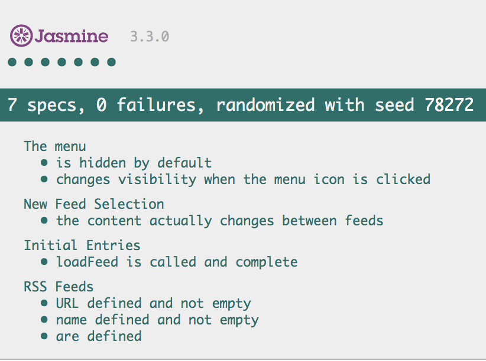

# Noura Feed Reader

It is a web-based application that reads RSS feeds. The main objective is using [Jasmine](http://jasmine.github.io/) to test the website.

### Installation
- Clone or download the project with all directories and main files.
- Click on index.html and open it in browser to see the website and test it.

### Test cases

### Refrences
- [Jasmine](http://jasmine.github.io/)
- [Starting code from udacity](https://github.com/udacity/frontend-nanodegree-feedreader)
